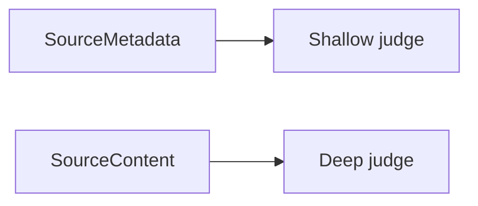

# Judge Agent

Judge source relevance for a specific task.

## Flow

## Contracts

- `from()` queues shallow-judged sources
- `fromDeep()` queues deep-judged sources
- `deep()` moves the current shallow queue into the deep queue
- `run(task)` evaluates both queues and returns `JudgeResults`
- `clear()` resets both queues

## Task Types

- `response` for direct response usefulness
- `proof` for evidence and grounding usefulness
- `other` for generic relevance checks

## Judgment Modes

- Shallow judging requires `source.metadata`
- Shallow prompts use `title`, `description`, and `keypoints`
- Deep judging uses `source.buildDeepJudgeInput()`
- Deep judging does not require metadata

## Output

Each source ID maps to:

- `score` between `0` and `1`
- `reason` as a concise factual explanation

## Failure Behavior

- Judgments run concurrently
- Individual failures are collected
- Any failure causes `run()` to throw after processing finishes
- `clear()` runs in `finally`, so queues are always reset
