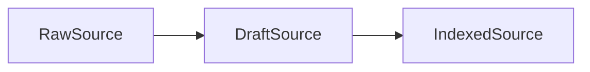

# Contextrie

<p align="center">
  <a href="https://flintworks.dev/blog/engineering/humans-managed-deep-contexts-agents-are-not-different" target="_blank" rel="noopener noreferrer"></a>
  <a href="https://www.youtube.com/watch?v=G0_LVAIyRWI" target="_blank" rel="noopener noreferrer"></a>
  <a href="https://discord.gg/ayX9hm4D" target="_blank" rel="noopener noreferrer"></a>
</p>


<p align="center">
  <a href="https://opensource.org/licenses/MIT" target="_blank" rel="noopener noreferrer"></a>
</p>

<p align="center"><strong>Dynamic context curation for long-running agent work.</strong></p>

AI agents lose accuracy and reasoning ability as they accumulate irrelevant context over long-running tasks. Contextrie dynamically curates what each agent sees, keeping it sharp from task one to task one thousand.

---

## Install

Core is now published on npm:

```bash
npm install @contextrie/core
```

Extremely brief how-to:

```ts
import { DocumentSource, IndexingAgent, JudgeAgent } from "@contextrie/core";

const source = new DocumentSource("doc-1", undefined, "your content");
const indexed = await new IndexingAgent(model).add(source).run();
const result = await new JudgeAgent(model).from(indexed).run({
  objective: "response",
  input: "your task",
});
```

---

## Repo Layout

```
.
├─ assets/        Visuals and branding
├─ cli/           Bun CLI wrapper
├─ core/          TypeScript library (npm)
├─ docs/          SvelteKit documentation site
├─ examples/      Minimal examples
├─ python/        Python package (stub)
└─ README.md      Project overview
```

---

## Concepts

- Parser: converts raw input into `DraftSource`
- IndexingAgent: turns `DraftSource` into `IndexedSource`

State flow:



---

## API Shape

- `ctx.ingest.from(input).run()`
- `ctx.assess.task(...).from(...).run()`
- `ctx.compose.task(...).from(...).run()`

---

## Getting Started

Each package maintains its own development and contribution instructions. Start in the package README for the area you are working on.

For library usage, start with [`core/README.md`](core/README.md).

---

## Status

Early development; expect breaking changes.
