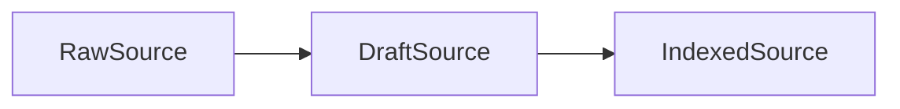

# Contextrie

<p align="center">
  <a href="https://flintworks.dev/blog/engineering/humans-managed-deep-contexts-agents-are-not-different" target="_blank" rel="noopener noreferrer"></a>
  <a href="https://www.youtube.com/watch?v=G0_LVAIyRWI" target="_blank" rel="noopener noreferrer"></a>
  <a href="https://www.npmjs.com/package/@contextrie/core" target="_blank" rel="noopener noreferrer"></a>
  <a href="https://discord.gg/ayX9hm4D" target="_blank" rel="noopener noreferrer"></a>
</p>


<p align="center">
  <a href="https://opensource.org/licenses/MIT" target="_blank" rel="noopener noreferrer"></a>
</p>

<p align="center"><strong>Dynamic context curation for long-running agent work.</strong></p>

AI agents get worse as irrelevant context piles up. Contextrie helps you select, index, judge, and compose the right context for each task so long-running agent systems stay sharp.

Contextrie is a context-engineering toolkit for agent workflows. The first published package is `@contextrie/core`.

---

## Start Here

Install the core package:

```bash
npm install @contextrie/core
```

Extremely brief how to:

```ts
import { openai } from "@ai-sdk/openai";
import {
  ComposerAgent,
  DocumentSource,
  IndexingAgent,
  JudgeAgent,
} from "@contextrie/core";

const model = openai("gpt-5.4");
const objective = "response";
const task = "Explain which internal docs matter most when debugging why retrieval is missing indexed metadata.";
const source = new DocumentSource(
  "indexing-architecture",
  undefined,
  "Indexed sources store generated metadata separately from source content, and shallow judgment relies on that metadata for fast relevance scoring.",
);
const indexed = await new IndexingAgent(model).add(source).run();
const judgments = await new JudgeAgent(model).from(indexed).run({
  objective,
  input: task,
});
const context = await new ComposerAgent(model)
  .from(
    Object.fromEntries(
      indexed.map((item) => [item.id, { source: item, decision: judgments[item.id] }]),
    ),
  )
  .run({
    objective,
    input: task,
  });

console.log(context);
```

---

## What This Is

Contextrie is for systems where agents should not see everything all the time.

It gives you primitives to:

- turn raw material into retrieval-ready sources
- generate metadata for those sources
- score relevance against a task
- compose a tighter working context for the next agent step

---

## Why It Exists

Most agent systems fail gradually, not instantly. They accumulate irrelevant context, lose precision, and waste tokens. Contextrie makes context selection a first-class part of the system instead of an afterthought.

---

## Packages

- `@contextrie/core`: published now, TypeScript contracts and core agents
- `docs`: documentation site in progress
- `parsers`: planned
- `cli`: planned
- `python`: planned

---

## Roadmap 🚧

- Python support
- Hosted docs site
- Parsers package
- CLI package on npm
- CLI package on Homebrew

---

## Call To Action

- Install and try `@contextrie/core`
- Read the manifesto
- Watch the demo
- Join the Discord
- Open an issue if you want a parser, adapter, or language target

---

## Repo Layout

```
.
├─ assets/        Visuals and branding
├─ cli/           Bun CLI wrapper
├─ core/          TypeScript library (npm)
├─ docs/          SvelteKit documentation site
├─ examples/      Minimal examples
├─ python/        Python package (stub)
└─ README.md      Project overview
```

---

## Concepts

- Parser: converts raw input into `DraftSource`
- IndexingAgent: turns `DraftSource` into `IndexedSource`

State flow:



---

## Getting Started

Each package maintains its own development and contribution instructions. Start in the package README for the area you are working on.

For library usage, start with [`core/README.md`](core/README.md).

---

## Status

Early development; expect breaking changes.
